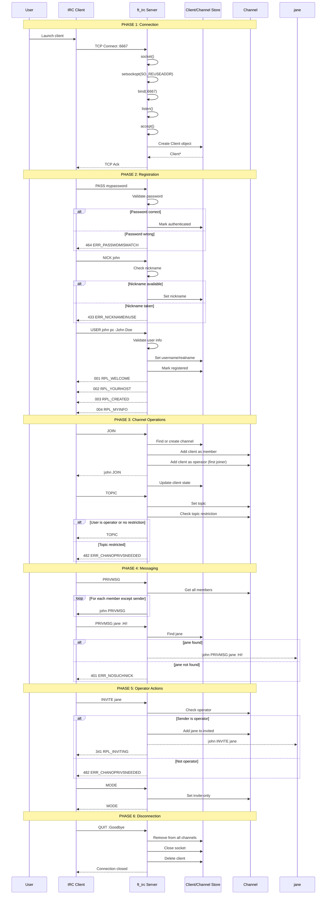
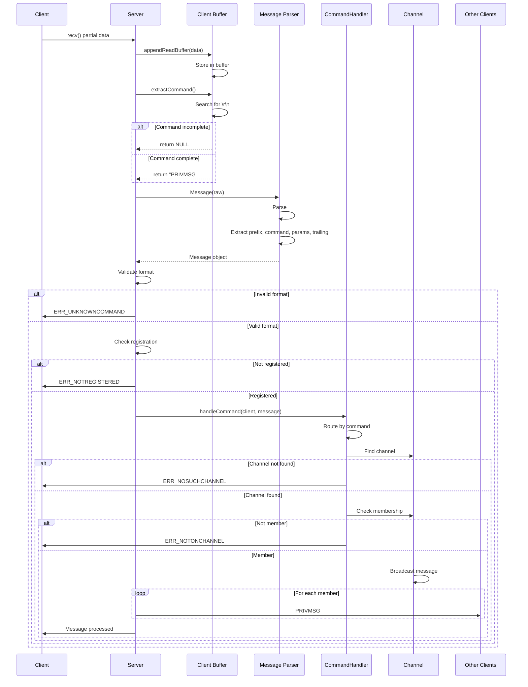
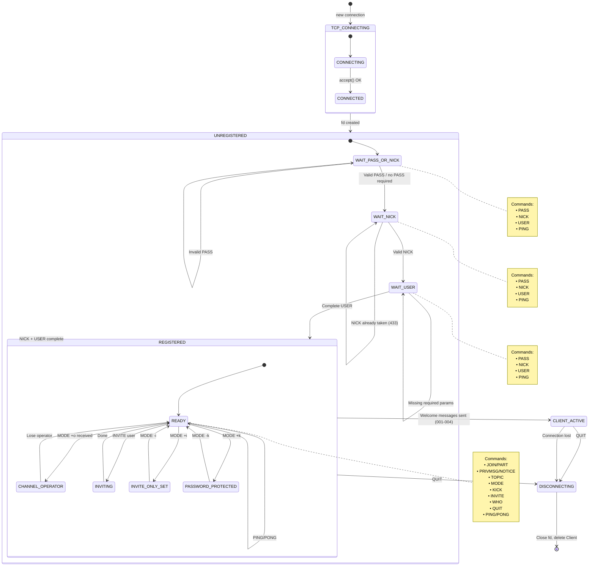
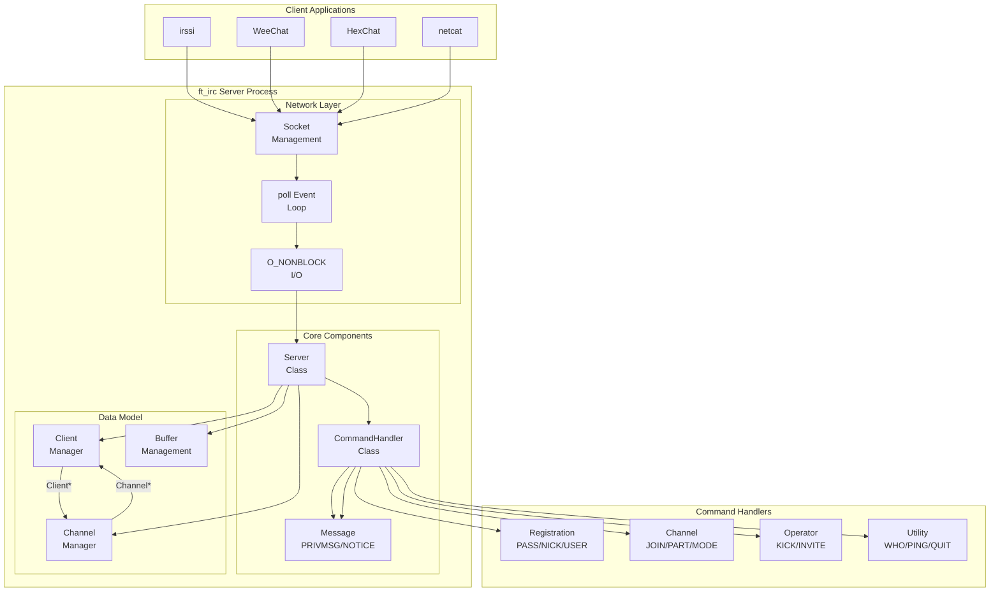
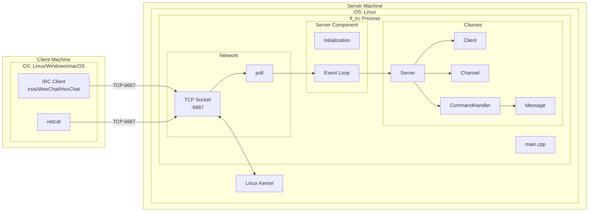
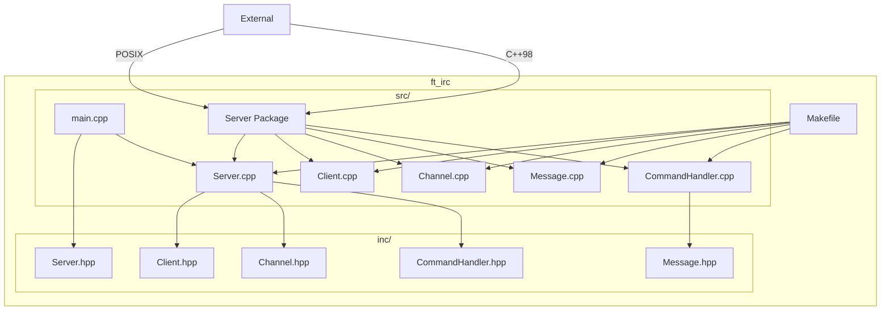

# ft_irc - UML Diagrams (Complete)

> Copiez tout le contenu ci-dessous dans [Mermaid Live Editor](https://mermaid.live/) pour visualiser

---

## UML Class Diagram - Complete Architecture

```mermaid
classDiagram
    class Server {
        -int _port
        -string _password
        -vector~pollfd~ _pollFds
        -map~int, Client*~ _clients
        -map~string, Channel*~ _channels
        -CommandHandler* _commandHandler
        +Server(port: int, password: string)
        +~Server()
        +run(): void
        -initNetwork(): void
        -acceptNewClient(): void
        -handleClientData(fd: int): void
        -removeClient(fd: int): void
        -findClient(nickname: string): Client*
        -findChannel(name: string): Channel*
    }
    
    class CommandHandler {
        -Server* _server
        +CommandHandler(server: Server*)
        +handleCommand(client: Client*, message: Message): void
        -handleRegistration(client: Client*, message: Message): void
        -handleJOIN(client: Client*, params: vector~string~): void
        -handlePART(client: Client*, params: vector~string~): void
        -handlePRIVMSG(client: Client*, params: vector~string~): void
        -handleNOTICE(client: Client*, params: vector~string~): void
        -handleMODE(client: Client*, params: vector~string~): void
        -handleTOPIC(client: Client*, params: vector~string~): void
        -handleKICK(client: Client*, params: vector~string~): void
        -handleINVITE(client: Client*, params: vector~string~): void
        -handleQUIT(client: Client*, message: string): void
        -handleNICK(client: Client*, params: vector~string~): void
        -handleUSER(client: Client*, params: vector~string~): void
        -handlePASS(client: Client*, params: vector~string~): void
        -handleWHO(client: Client*, params: vector~string~): void
        -handlePING(client: Client*, params: vector~string~): void
    }
    
    class Client {
        -int _fd
        -string _readBuffer
        -string _writeBuffer
        -string _nickname
        -string _username
        -string _hostname
        -string _servername
        -string _realname
        -bool _isRegistered
        -bool _isAuthenticated
        -vector~string~ _joinedChannels
        -vector~string~ _invitedChannels
        +Client(fd: int)
        +~Client()
        +getFd(): int
        +getNickname(): string
        +setNickname(nick: string): void
        +getUsername(): string
        +setUsername(user: string): void
        +getHostname(): string
        +setHostname(host: string): void
        +getRealname(): string
        +setRealname(real: string): void
        +isRegistered(): bool
        +setRegistered(reg: bool): void
        +isAuthenticated(): bool
        +setAuthenticated(auth: bool): void
        +appendReadBuffer(data: string): void
        +extractCommand(): string
        +queueData(data: string): void
        +getWriteData(): string
        +clearWriteBuffer(): void
        +addJoinedChannel(channel: string): void
        +removeJoinedChannel(channel: string): void
        +getJoinedChannels(): vector~string~
    }
    
    class Channel {
        -string _name
        -string _topic
        -string _password
        -int _userLimit
        -bool _inviteOnly
        -bool _topicRestricted
        -bool _hasPassword
        -map~string, Client*~ _members
        -map~string, Client*~ _operators
        -vector~string~ _invited
        +Channel(name: string)
        +~Channel()
        +getName(): string
        +getTopic(): string
        +setTopic(topic: string, client: Client*): void
        +getPassword(): string
        +hasPassword(): bool
        +checkPassword(pass: string): bool
        +setPassword(pass: string): void
        +addMember(client: Client*, key: string): bool
        +removeMember(client: Client*): void
        +isMember(client: Client*): bool
        +isOperator(client: Client*): bool
        +addOperator(client: Client*): void
        +removeOperator(client: Client*): void
        +invite(client: Client*): void
        +isInvited(client: Client*): bool
        +getMembers(): vector~Client*~
        +broadcast(message: string, sender: Client*): void
        +isInviteOnly(): bool
        +setInviteOnly(invite: bool): void
        +isTopicRestricted(): bool
        +setTopicRestricted(restricted: bool): void
        +getUserLimit(): int
        +setUserLimit(limit: int): void
        +isFull(): bool
    }
    
    class Message {
        -string _raw
        -string _prefix
        -string _command
        -vector~string~ _parameters
        -string _trailing
        +Message()
        +Message(raw: string)
        +parse(): void
        +getPrefix(): string
        +getCommand(): string
        +getParameters(): vector~string~
        +getTrailing(): string
        +hasTrailing(): bool
        +toString(): string
        +fromClient(client: Client*): void
    }
    
    Server "1" *-- "*" Client : manages
    Server "1" *-- "*" Channel : manages
    Server "1" --> "1" CommandHandler : uses
    CommandHandler "1" --> "1" Server : uses
    CommandHandler "1" --> "*" Client : handles
    CommandHandler "1" --> "*" Channel : handles
    Client "*" -- "*" Channel : joins
    Channel "1" -- "*" Client : contains
    CommandHandler "1" --> "1" Message : parses
    
    class ClientRegistration {
        <<enumeration>>
        UNREGISTERED
        WAIT_NICK
        WAIT_USER
        REGISTERED
        ACTIVE
    }
    
    class ChannelMode {
        <<enumeration>>
        INVITE_ONLY = 'i'
        TOPIC_RESTRICTED = 't'
        PASSWORD = 'k'
        OPERATOR = 'o'
        USER_LIMIT = 'l'
    }
    
    class IRCCommand {
        <<enumeration>>
        PASS
        NICK
        USER
        JOIN
        PART
        PRIVMSG
        NOTICE
        TOPIC
        MODE
        KICK
        INVITE
        QUIT
        WHO
        PING
        PONG
    }
```

---

## UML Use Case Diagram

```mermaid
graph TD
    subgraph Actor["Actor"]
        U[User]
        O[Operator]
        A[Admin]
    end
    
    subgraph UseCases["ft_irc Use Cases"]
        UC1[Connect to Server]
        UC2[Authenticate with Password]
        UC3[Set Nickname]
        UC4[Set Username]
        UC5[Join Channel]
        UC6[Leave Channel]
        UC7[Send Channel Message]
        UC8[Send Private Message]
        UC9[Change Topic]
        UC10[Invite User to Channel]
        UC11[Kick User from Channel]
        UC12[Set Channel Mode]
        UC13[Set Channel Password]
        UC14[Set User Limit]
        UC15[Become Channel Operator]
        UC16[Transfer Operator]
        UC17[PING/PONG Keepalive]
        UC18[Query Users]
        UC19[Disconnect]
    end
    
    U --> UC1
    U --> UC2
    U --> UC3
    U --> UC4
    U --> UC5
    U --> UC6
    U --> UC7
    U --> UC8
    U --> UC9
    U --> UC17
    U --> UC18
    U --> UC19
    
    O --> UC10
    O --> UC11
    O --> UC12
    O --> UC13
    O --> UC14
    O --> UC15
    O --> UC16
    
    A --> UC1
    A --> UC2
    A --> UC3
    A --> UC4
```

---

## UML Sequence Diagram - Full Connection Flow

---

## UML Sequence Diagram - Message Processing

---

## UML State Machine Diagram - Client Lifecycle

---

## UML Component Diagram

---

## UML Deployment Diagram

---

## UML Package Diagram

---

Pour visualiser **tout d'un coup** :
1. Ouvrez [Mermaid Live Editor](https://mermaid.live/)
2. Copiez **tout le contenu** de ce fichier
3. Cliquez sur "Sync"
